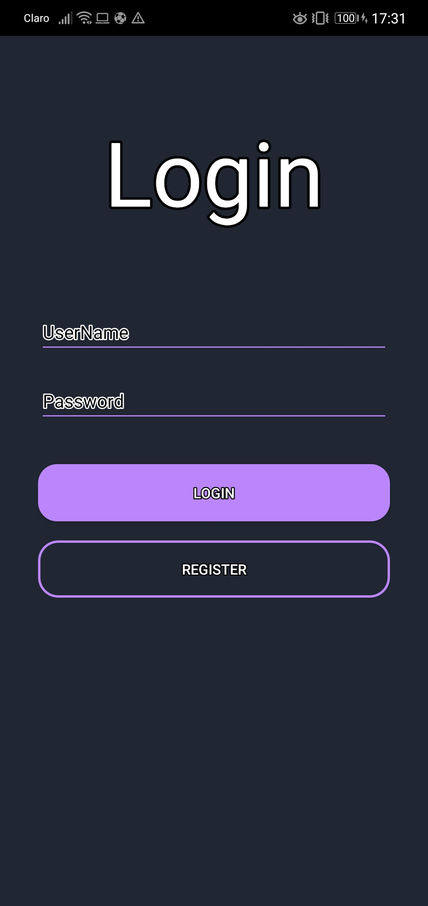
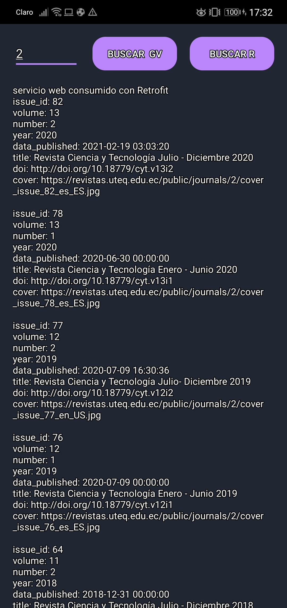
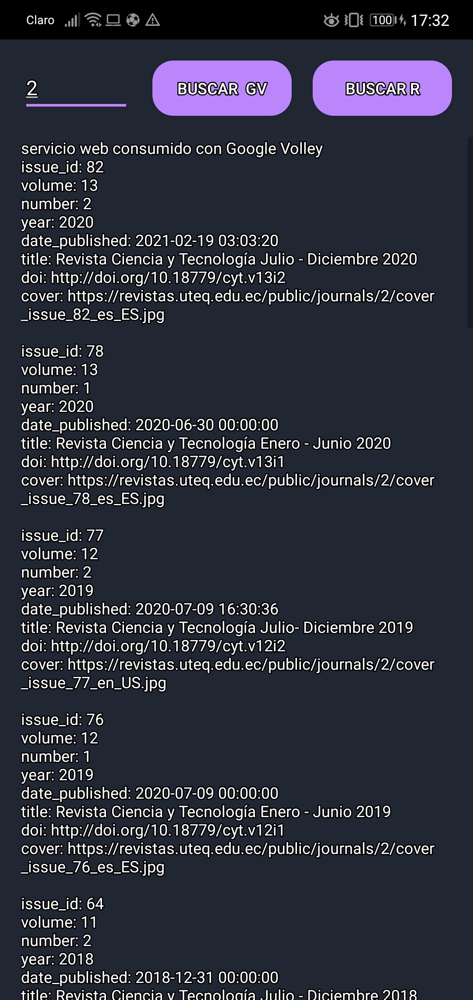
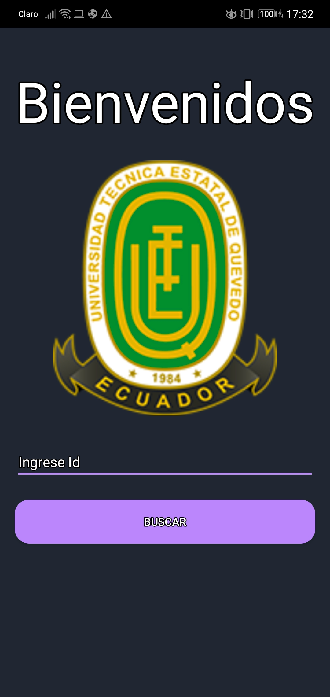

# APLICACIONES-MOVILES
programas app movil
<h1>primer trabajo</h1>
<h3>CONSUMIR UNA API RESTFUL EN ANDROID USANDO API RETROFIT Y VOLLER</h3>
cuando se abre la aplicación aparece este login  
aquí ingresa el usuario "cristian" password "cristian123" 
verifica si existe ese usario consumiendo un servicio proporcionado por el docente 

una vez validado el ususario se abrirá el buscador 
aquí se puede buscar las revistas consumiendo un web service mendiante Retrofit o Google Volley 
se proporciona el Id de la revista y saldrá los resultados 

esto es un consumo con Retrofit 

esto es un consumo de Google Volley 

<h1>segundo trabajo</h1>
<h3>PRESENTAR LISTA DE ITEMS CON RECYCLERVIEW CON CARDVIEW ITEMS (LISTA DE VOLS REVISTA CIENTIFICAS UTEQ)</h3>
en esta sección ingresa el ID de la revista para buscar  

aqui se muestra las revistas haciendo uso de CardView para cada item  

otra presentación de las revistas de la UTEQ 

